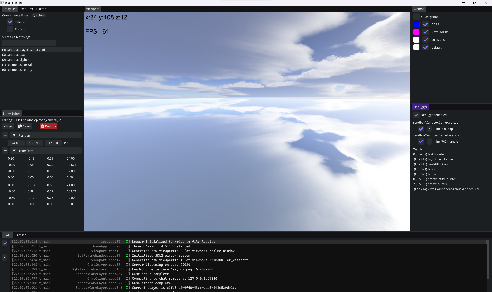

# RealmE - Realm Engine public page
A voxel game (engine) with a build-in modding environment, not yet ready for a public release

Formerly known as a low-poly game library TilesGE. Realm Engine is being developed in a private repository, with this repo containing an overview and updates.
For nostalgic purposes code of one of the early versions of TilesGE is available.

Project goal - explore possibilities of voxel world representation, by implementing voxel physics and simulation engine. 

## Overview

Editor features:
- ECS entity viewer and editor
- Log tab with colors!
- Tracy profiler integration
- Debug gizmo drawing with groups
- Instrumented debugger and value watcher, aware of the game loop
